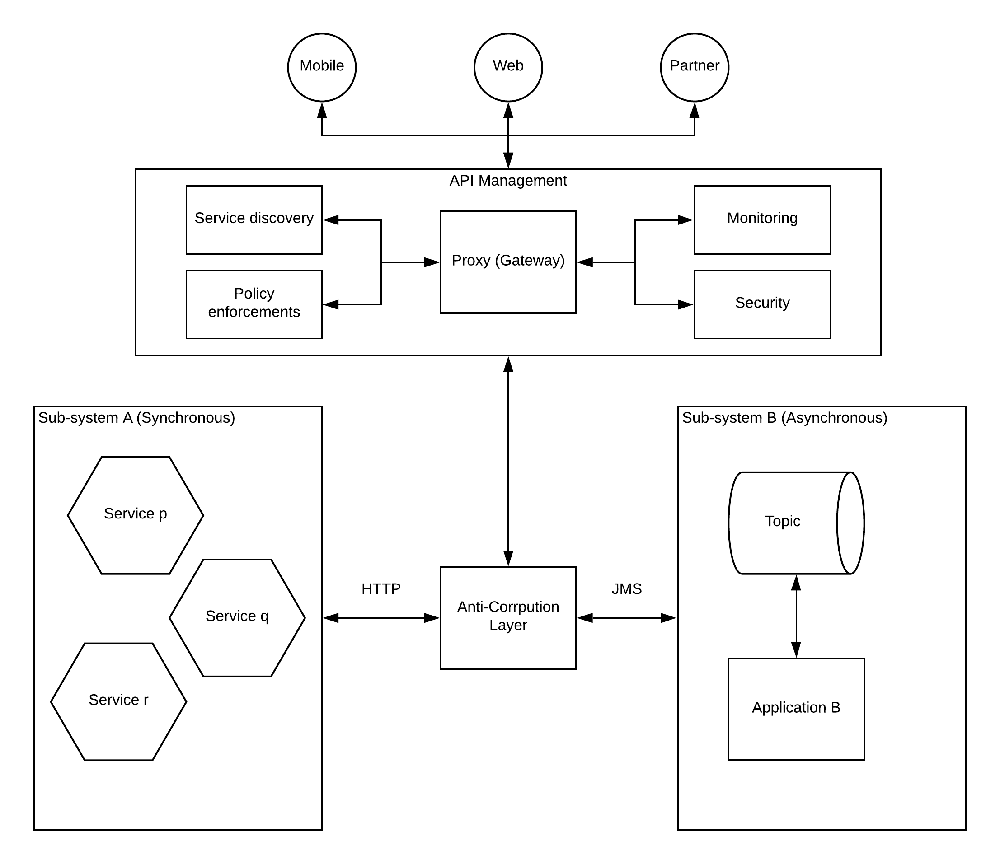

## Anti Corruption Layer Pattern

### Introduction

Enterprise software systems are built with heterogenous systems which uses best of breed technologies to solve the respective problem at hand. Here are some examples

- ERP systems uses proprietary protocols which are efficient in storing and managing enterprise resources (e.g. SAP)
- Data warehousing tools uses relational or no-sql type databases
- Web services use SOAP+XML or REST+JSON over HTTP
- Asynchronous message processing systems may use message queueing protocols like JMS, AMQP, STOMP

Even though these systems are built in isolation, they can't operate in isolation within enterprise. They need to talk to other systems to provide value to the end customers. 

### Architecture

When one system needs to talk to another system and if these 2 systems are not compatible, you can use an intermediate layer which is capable of translating first systems communication to the protocol which is used by the second system and vice versa, this intermediate system is called as an Anti Corruption Layer since that layer helps to avoid the data corruption which would have happened otherwise. This is not a new concept and the traditionally, Enterprise Service Bus (ESB) has been used as this intermediate layer. 

As depicted in the above figure, putting an intermediate anti corruption layer component only will not solve the modern enterprise requirements. Instead, various client applications require to access the capabilities of these heterogenous systems. API Management layer can help in exposing these internal complex systems to external clients through a standard based, managed interface. Sometimes, this same API management layer can act as the anti corruption layer. 

### When to use

Unless otherwise you have all your systems communicated over a single protocol like HTTP, having an anti corruption layer is required to integrate heterogenous systems within an enterprise. By using this pattern, you can avoid building point to point spaghetti type architectures in the long run. 

### Advantages

Here are some of the advantages of using this pattern.

- No need to customize systems when talking to another system. The protocol translation happens at intermediate layer
- Error handling can be done at the intermediate layer
- Functionalities can be exposed to external world through a standard interface
- Systems can optimize their implementations without dropping their efficiency on compatibility
- Services are easier to discover

### Future

With more and more people moving into micro type architectures, some architects think that this anti corruption layer is no longer required and the communication to these heterogenous systems can be done through a some type of a distributed proxy (sidecar) which runs along with the microservice. Some argues that service mesh is the distributed version of the traditional ESB or the anti corruption layer. But doing the heavy lifting of protocol translations, message translations along with supporting many different types of protocols needs to be implemented in these service meshes if they are to become the future anti corruption layer.
