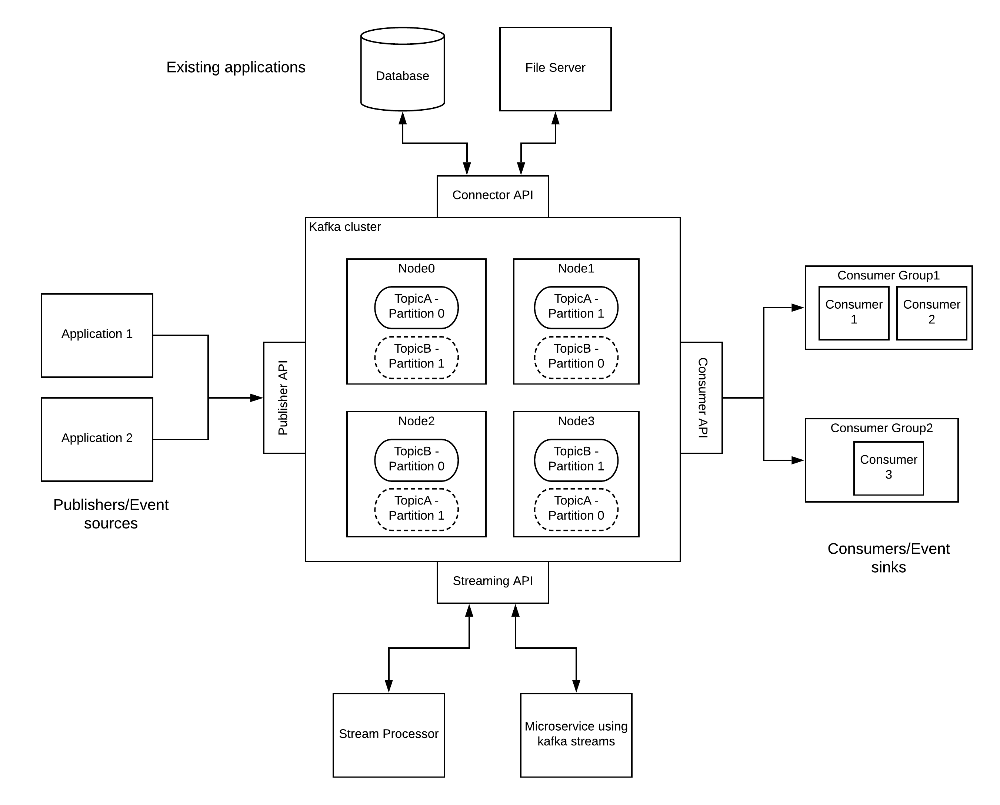

# Event driven architecture with Kafka

## Introduction
Apache Kafka has evolved as the defacto standard for building reliable event based systems with ultra high volumes. The unique, yet simple architecture has made Kafka an easy to use component which integrate well with existing enterprise architectures. At a very high level, it is a messaging platform which decouples the message producers from the message consumers while providing the reliability of message delivery to consumers at scale. Kafka has message producers which send messages (events) to kafka which kafka stores in a entity called a topic which will deliver the messages to one or more consumers in a reliable manner. There can be different types of producers and consumers depending on the use case.

## Architecture
Kafka architecture is a simple yet powerful architecture which blends well within most of the existing architectures. 

Kafka can run on a cluster of nodes spanning across multiple machines, multiple data centers, mutiple regions. Kafka has the capability to expand across geographically distributed resources. Once Kafka cluster is set up, external applications and systems can interact with the cluster through 4 standard APIs. 

- Publisher API - This is used by event sources which generates events to send those events in large magnitudes to the kafka cluster. Kafka cluster stores these events in topics which are partitioned so that these topics can scale beyond a single server. These partitions are replicated across multiple nodes in case if one node goes down, the data is not going to be lost. These events are stored for a configurable duration regardless of whether they are consumed or not. During the time of publishing the events, publishers can specify the parition in which the event is going to be stored in a given topic. 

- Consumer API - The events stored in the topics are delivered to consumers who are subscribed to these topics. Unlike in standard pub-sub based topics, the consumer has total control over reading the messages from the topics. Consumer can control the offset value which tells the position of the message within a given partition so that consumers can read messages from any location within a given topic and a parition. Additionally, kafka comes with the concept of a consumer group through which, the consumers can balance load across multiple competing consumers similar to a queue based subscription. There can be multiple consumer groups subscribed to a given topic and each consumer group will get a one copy of the message at a given time. A given consumer within a consumer group is bounded to a given parition within a topic. Hence there cannot be more consumers within a group than the number of paritions of a topic. 

- Connector API - Sometimes kafka needs to be integrated with existing applications and systems. As an example, if we want to read a set of log files through kafka to process the data within those files using a stream processor, kafka provides the connector API to implement reusable components called connectors. The same connector can be used for any file based integration with kafka. 

- Streaming API - The events stored in kafka sometimes needs to be processed in real-time for various purposes like transformation, correlation, aggregation, etc. These sort of functionalities can be applied through a stream processor which acts on a continous stream of records. Kafka streaming API exposes a topic as a stream of events so that any other stream processor engine can consume that and do processing. 

## Advantages
Kafka has aggregated several advantages of existing messaging systems into a one single solution through it's unique design. Here are some of the advantages of Kafka

- Ability to build cloud scale message processing platforms with fault tolerance
- Message persistence and durability with a configurable retention period with control at the consumer end allows consumers the freedom to process messages at their will
- Order of the messages are guaranteed within a parition which is critical in some use cases
- Replication allows messages to be stored reliably so that failure of n-1 nodes within a n node cluster with replication count of n does not affect the message delivery to the consumers
- Scalability of cluster allows to deploy the system across multiple data centers for highest levels of availability and better performance
- Streams API allows the events to be processed in real-time with stream processing engines

## Use cases
- Build reliable messaging platforms which delivers messages across systems at cloud scale
- Build real time event processing systems with machine learning, AI based processing
- Build large scale data processing systems like log monitoring, ETL based systems
- Build systems with event sourcing where each activity is considered as a an event which is attached to an event log
