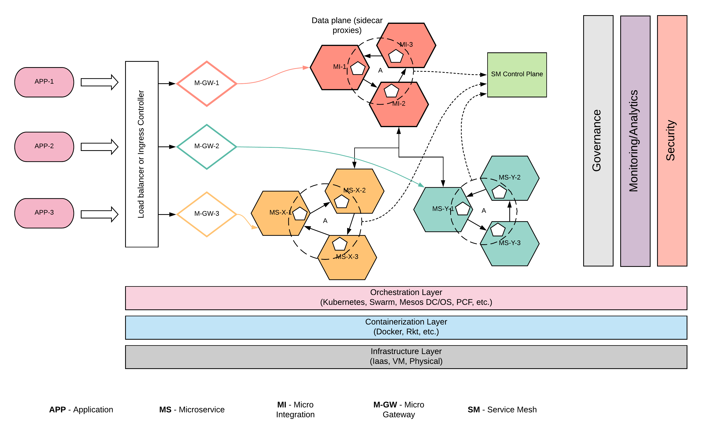

## Micro Architecture Pattern

### Introduction
Microservices Architecture (MSA) is becoming the SOA of the modern era. Like the way SOA improved the enterprise software architecture with new patterns and architectures around that, Microservices Architecture (MSA) has tripped off several new architectural styles and new concepts around how people build enterprise software. Some of them are

- Service Mesh  — Technique to communicate amongst microservices
- Serverless  — Running your code as functions on cloud
- Micro Integration  — Run your integrations as microservices
- Micro Gateway  — Run your api gateways in a microservices compatible manner

All these architectures can be categorized under the common umbrella of "microservices" and if we can identify an architecture style which supports all these different micro-micro architectures, that can be called as micro architecture. 

### Micro Architecture

As depicted in the above figure, micro architecture is independent from any type of infrastructure or vendor or technology. It is an open architecture which can be implemented using the best suitable technology or vendor for specific enterprise. Let’s understand the micro-architecture a bit more in respect to the above figure.

We have 3 groups of micro services in the figure with 3 different colors. The microservices started with MS are real back end business logic implementations. MS-X and MS-Y depicts 2 groups of micro services (e.g. lending and deposits microservices groups in a banking system). Each hexagon depicts a load-balanced, high available microservice (e.g. kubernetes service). The hexagons marked with MI are integration microservices which are integrating existing micro services (MS type) and provide a complex and advanced functionality.

The arrows connecting microservices with each other depicts the service mesh functionality and internally, it uses a side car proxy (or not depending on the selected technology stack). This component provides functionalities like timeout, retry, circuit breaker, service discovery, load balancing at the transport layer(L3/L4). Then the configuration of the service mesh is done through the control plane of the service mesh.

Then we have the 3 diamonds which demonstrate the API micro gateway functionality where these gateways offers functionalities like security, caching, throttling, rate limiting and analytics capabilities to the upstream micro services layer. In this diagram, we have used 3 different micro gateways for 3 groups of microservices. This can be extended in such a manner that each MS or MI can have their own micro gateway.

Micro API Gateway is a special component in this architecture since it has some cross cutting features which are already available in other components. If we take the functionality of service mesh, it has some capabilities like load balancing, service discovery, circuit breaker which are already available in the micro gateway. It is important understand that these functionalities are available for internal, inter-micro service communication while micro gateway uses these functionalities to expose services externally. Which means that we cannot dismiss the necessaity of api gateway within a service mesh type architecture.

The other cross-cutting component which overlaps with the micro api gateway is the micro integration layer where some capabilities like service orchestration, transformation and composition can be done at that layer. Here also we need to clearly understand that the micro integration layer offers these capabilities for internal services and at the developer level. But the types of capabilities available at the micro gateway are more towards external user interaction layer and sometimes users can directly use these features like API composition to build their own APIs.

On the other hand, using Micro API Gateway as a replacement for service mesh or micro integration layer is not recommended even though it can serve the purpose for some of the cases. That approach will introduce lot more complexities when your system grows in the future.

The next advancement or the service which can offer through this micro-architecture is the serverless (or Function as a Service — FaaS) capability to developers. Any technology vendor can combine the infrastructure layer with the micro gateway and micro integration capabilities which are hosted on their data centers to offer the serverless service to their customers so that customer can write their implementations in whatever the preferred programming language and run them as microservices under the hood within their infrastructure. In a serverless world, MS type implementations will be done by the users and all the other components will be deployed, hosted and maintained by the cloud provider.

Finally, the applications can consume the relevant APIs by contacting relevant micro gateways. Based on the application type and the API requirements, same application can use all the micro gateways as well.

As the last piece of this article, I’ll share some of the existing technologies which can utilize to realize this micro-architecture.

#### Microservices

- Java (SpringBoot, DropWizard)
- Javascript (NodeJs)
- Go

#### Micro Integrations

- Ballerina
- Java (Spring Boot)

#### Service Mesh

- LinkerD
- Istio/envoy
- Nginx

#### API Micro Gateway

- WSO2 APIM
- Apigee
- Kong

#### Infrastructure

- IaaS (GCP, AWS, Azure)
- VM (VMWare)
- Physical (Bare metal)

#### Containerization

- Docker
- Rocket

#### Orchestration

- Kubernetes
- Docker Swarm
- Mesos DC/OS
